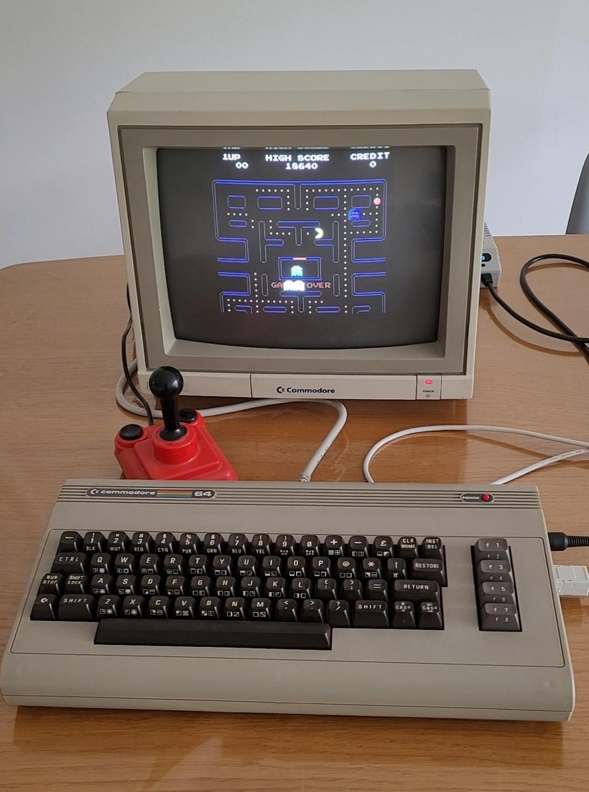
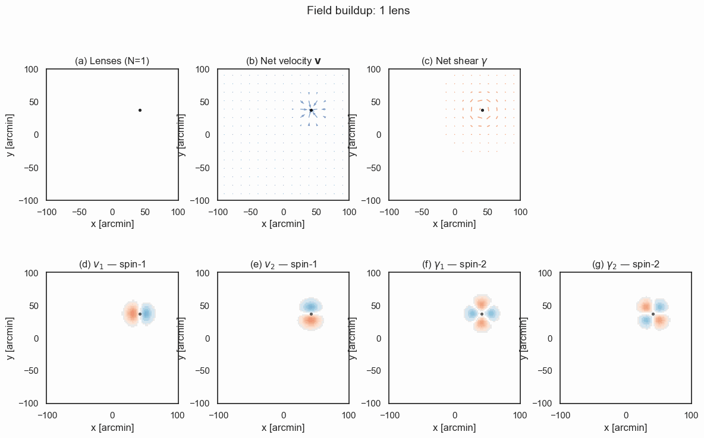
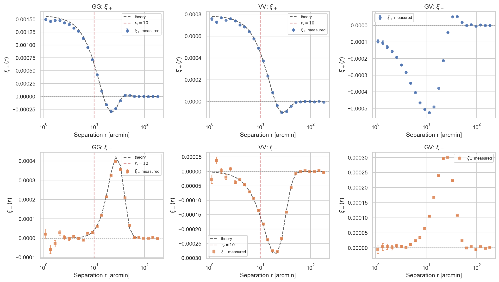
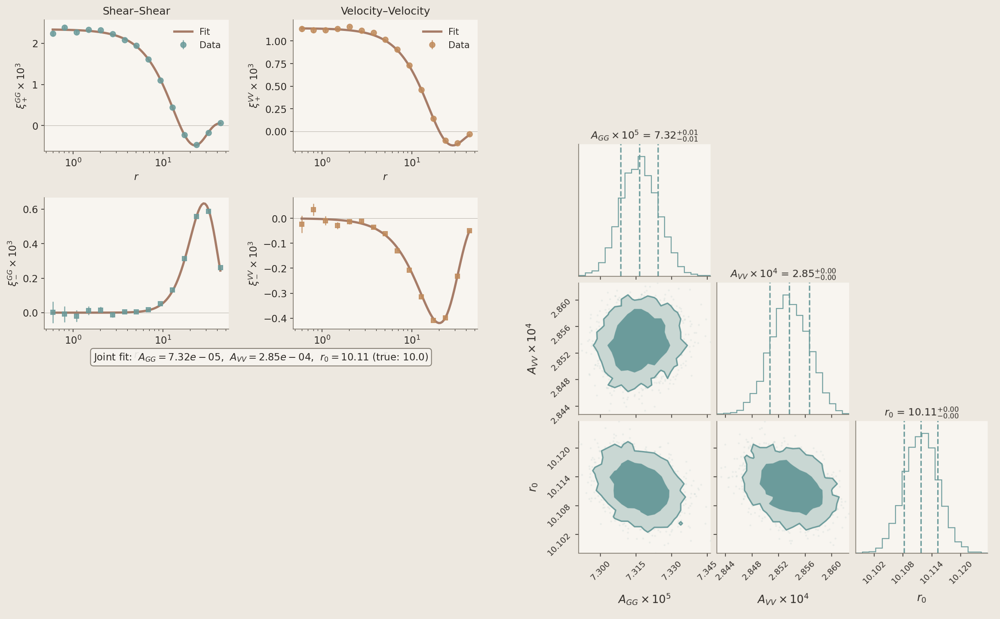

author: @cailmdaley, @EiffL, @calumhrmurray
summary: Learn how to use AI Agents for your research workflows, focusing on context management, skill extension, and verification of scientific code.
id: agent-loops
categories: AI, agents, cosmology, scientific-computing
environments: Web
status: Published
feedback link: https://github.com/CosmoStat/Tutorials/issues

# Agent Loops: Software Engineering in 2026

## Overview
Duration: 0:01:00

### What You'll Learn

- How AI coding agents work, what a model harness is, and why agents are different from chatbots 
- Managing context: in-session vs. persistent memory
- Extending agents with skills and plugins
- Verifying AI-generated scientific code
- Engineering feedback loops to reduce manual intervention

### What You'll Do

You'll use an AI agent to implement a real feature in a cosmology library, then verify the results by building an independent, scientifically motivated check.


### Prerequisites

- Python 3.9+ with pip
- Basic familiarity with the command line
- A working Claude Code installation (`curl -fsSL https://claude.ai/install.sh | bash`)
- Helpful: familiarity with cosmology concepts (lensing, correlation functions)

## What Makes an Agent Different from a Chatbot?
Duration: 0:10:00

### LLM vs. Agent

A **large language model (LLM)** takes text in and produces text out. Claude, GPT-4, Gemini — at their core, they're sophisticated **simulators** of text.

An **agent** is an LLM wrapped (trapped?) in a loop with access to tools (Read, Write, Bash):

```python
context = startup_context + user_prompt
while True:
    response = llm(context)
    if response.has_tool_calls:
        context += execute(response.tool_calls)
    else:
        break # pass turn back to user
```

| Chatbot | Agent |
|---------|-------|
| Single turn: prompt → response | Multi-turn: prompt → action → observation → action → ... |
| You execute the suggestions | Agent executes its own suggestions |
| No memory of execution results | Sees results, adapts, retries |
| You are the feedback loop | Agent is the feedback loop |


Every AI coding tool you've heard of — Claude Code, Cursor, Codex, Gemini CLI — is built on this same pattern. The model is the engine and does almost all the work. The loop + tools is what makes it an agent.

### What is a Model Harness?

The **harness** is everything except the model itself. Think of the model as an engine; the harness is the car — steering, brakes, dashboard, fuel system.


Note: The model is increasingly commodity — Claude Opus 4.5, ChatGPT 5, Gemini 3 perform similarly on benchmarks. **The harness determines whether agents succeed or fail.** This is why Anthropic, Google, and OpenAI are all investing heavily in harness engineering, not just model training.

A caveat: this is only true because frontier models are roughly equivalent. When there are big jumps in capability, SOTA model beats best harness. But with Opus 4.5, we may be at the point where raw intelligence isn't the limiting factor — harnessing is.

### The Agent Landscape in 2026

By the end of 2025, roughly 85% of developers regularly used AI tools for coding. Andrej Karpathy on the shift:

```text
Given the latest lift in LLM coding capability, like many others I rapidly
went from about 80% manual+autocomplete coding and 20% agents in November
to 80% agent coding and 20% edits+touchups in December.
```
This isn't just for code: mathematicians like Terence Tao use agentic harnesses for mathematics.

---

All major AI labs now ship agent harnesses for coding:

| Tool | Interface | Approach |
|------|-----------|----------|
| **Claude Code** / **Codex** | Terminal-first CLI | Autonomous multi-file operations, background agents, context compaction. Codex is open source, longer-running, harder to steer. Claude Code is more interactive, easier to steer, better at communicating what it's doing. |
| **Cursor** | AI-native IDE | Real-time code completion, inline chat, repository-wide edits |
| **Gemini CLI** | Terminal CLI | Google Search grounding, 1M token context, MCP extensibility, unlimited image generation |

These tools are **converging**. Cursor's agent mode looks like Claude Code's agents. Codex adopted similar patterns. 

### Claude Code: A Closer Look

Since we'll use Claude Code in this tutorial, here's what it does under the hood:

**Core capabilities:**
- **File operations**: Read, write, edit files in your codebase
- **Shell execution**: Run tests, build commands, git operations
- **Web search**: Look up documentation, APIs, error messages
- **Sub-agents**: Spawn background workers for parallel tasks

**The workflow:**


Implementation — turning a specification into code — is increasingly handled by agents. What remains is **shaping what to build**, **noticing when it's wrong**, and **deciding what to try next**.

## Setup
Duration: 0:05:00

### Install Claude Code

**Prerequisites:** A [Claude subscription](https://claude.com/pricing) (Pro, Max, Teams, or Enterprise) or a [Claude Console](https://console.anthropic.com/) account with API access.

**macOS / Linux / WSL (recommended):**

```bash
curl -fsSL https://claude.ai/install.sh | bash
```

### First Run & Authentication

Navigate to any project and start Claude Code:

```bash
git clone --branch tutorial/agent-loops https://github.com/CosmoStat/Tutorials.git
cd Tutorials
claude
```

On first run, you'll be prompted to authenticate:
1. A browser window opens to claude.ai
2. Log in with your Anthropic account
3. Authorize Claude Code
4. Return to your terminal — you're ready to go

**A note on models:** Claude offers three flavors of model, in increasing levels of intelligence~cost: Haiku, Sonnet, & Opus. Claude may default to Sonnet, but we **highly** recommend using Opus 4.5. Despite the fact that it is more expensive per "token" (LLM currency), it makes much fewer mistakes than Sonnet and thus has a similar cost / task since it is more likely to "one-shot" a task. You can set this in Claude Code with `/model`.

### Install TreeCorr (for this tutorial)

We'll add a feature to [TreeCorr](https://github.com/rmjarvis/TreeCorr), a library for computing correlation functions in cosmology.

```bash
git clone https://github.com/rmjarvis/TreeCorr.git # can do this inside Tutorials/
cd TreeCorr
pip install -e .
```

### Project Structure

After setup, your workspace should look like:

```
TreeCorr/
├── treecorr/           # Main library code
│   ├── corr2.py        # 2-point correlation functions
│   ├── ggcorrelation.py
│   └── ...
├── tests/              # Test suite
├── CLAUDE.md           # Will be created by /init
└── .claude/
    └── skills/         # Custom skills (optional)
```

**How to verify TreeCorr:** Run `python -c "import treecorr; print(treecorr.__version__)"` — you should see a version number.

## Implement a New Feature
Duration: 0:15:00

### The Task

We'll ask the agent to add **shear-velocity correlations (spin-2 × spin-1)** to TreeCorr. This feature doesn't exist yet.

**Physics context:** Gravitational lensing shear traces mass along the line of sight — light bends around structure. Transverse velocities flow toward overdense regions as matter falls into potential wells. The cross-correlation probes structure growth differently than either field alone.


Transverse velocity is usually not an observable in cosmological contexts, which is why this correlation function isn't in TreeCorr (Mike Jarvis: "I didn't bother implementing VG correlations (spin-1 with spin-2), since that seems not likely to be useful").

However Calum has a nice observable that was the inspiration for this example: **apparent** proper motion of quasars driven by LSS evolution, which imparts a time-varying lensing deflection angle $\alpha$. With $\mu$as resolution (futuristic but feasible), one could measure quasar proper motions and correlate this field with cosmic shear.

### Initialize Project Context

First, let the agent learn about the codebase. In the `TreeCorr` directory, start `claude` and run:

```console
/init
```

This creates a `CLAUDE.md` file — the agent reads the codebase and writes itself notes on how to work here.

### Run the Implementation

Now enter this prompt; it's good to use **plan mode** for complex tasks, which can be done by pressing Shift+Tab or by adding something like "let's make a plan first" to your prompt.

```text
please implement shear-velocity correlation functions in TreeCorr.
```

Then watch.

### What to Observe

As the agent works, notice:

1. **File exploration** — it reads existing correlation classes to understand patterns
2. **Test discovery** — it finds how other correlations are tested
3. **Iterative fixing** — when tests fail, it reads the error and adjusts
4. **Context compaction** — if context fills up, older content gets summarized

### Before vs. After

| Manual Implementation | Agent Implementation |
|-----------------------|----------------------|
| Read existing code patterns | Agent reads code patterns |
| Write new correlation class | Agent writes class |
| Write tests | Agent writes tests |
| Run tests, debug, repeat | Agent runs tests, debugs, repeats |
| ~1-2 days for a researcher | ~15-20 minutes |

The agent may run out of context and need compaction. It may make mistakes and backtrack. This is normal — the key is that it handles the feedback loop ~autonomously. 

Your role is now to cultivate the right context (CLAUDE.md, prompt, etc.), steer, and crucially, **verify/validate at higher levels of abstraction.** You may notice that in the above table, two of the most common verification techniques (reading code, writing tests) are now being handled by the agent...

## Context Management
Duration: 0:10:00



Understanding context is essential for effective agent use. In some ways, we're back to the old days of Commodore 64s (the best-selling desktop computer of all time) with 64 KB of RAM. Opus' context window is 200K tokens, so actually many times bigger than a Commodore 64's, but you get the point: memory allocation and freeing is important again.

Polluting context with irrelevant content is harmful. Try not to let things run to the end of the context window; the model gets dumb. The game is keeping context focused on what matters for the current task.

### Two Types of Context

**In-session context** is what the model sees right now:
- System prompt + Claude.md
- Your conversation
- Files it has read
- Tool outputs and errors

As in-session context it fills up, performance tends to go down (some call this the "dumb zone"). This is somewhat to analagous to how human performance goes down towards the end of a long work day.

- **Compaction**: Most harnesses have a `/compact` command which performs a lossy compression of the context window; this is often done automatically when the context window fills up. The compression may not keep the right context, and some think it's much better to `/clear` and rebuild context from "disk" so to speak.

**Persistent context (CLAUDE.md)** survives across sessions:

```
~/.claude/
└── CLAUDE.md              # User-level: your preferences everywhere

TreeCorr/
└── CLAUDE.md              # Project-level: instructions for this codebase
```

Both load automatically at session start.

### Exercise: Inspect the Context

Look at the `CLAUDE.md` the agent created during `/init`:

```bash
cat CLAUDE.md
```

What conventions did the agent notice? What build commands did it record?

Ask yourself:
- What did it notice about the codebase structure?
- What testing patterns did it identify?
- What would you add or correct?

### Extending Capabilities

**Skills** are reusable instruction bundles, or lazily-loaded context.

```
.claude/
└── skills/
    ├── data-visualization/
    │   ├── SKILL.md
    │   └── references/
    │       ├── color-palettes.md
    │       ├── design-system.md
    │       └── viz-catalog.md
    ├── frontend-design/
    │   └── SKILL.md
    ├── managing-bibliography/
    │   └── SKILL.md
    └── revealjs/
        ├── SKILL.md
        └── references/
            ├── advanced-features.md
            └── charts.md
```

**MCPs** connect to external or local services (databases, APIs, issue trackers), and expose a set of new functions that the agent can call like any other tool. These were all the rage in early 2025, but have lost some momentum because they can be insecure and are context gluttons. Claude Code has started lazily loading MCP functions so the context is less of an issue, but MCPs are still disfavored at the moment.

**Plugins** allow you to share and install skills, MCPs, etc. kind of like VS Code Extensions. Anyone can create a plugin; Anthropic maintains a couple high-quality marketplaces for [skills specifically](https://github.com/anthropics/skills) and [plugins generally](https://github.com/anthropics/claude-plugins-official) (unclear to me if the latter is ..). You can install like

```console
/plugin marketplace add anthropics/skills
/plugin marketplace add anthropics/claude-plugins-official
# then run /plugin to explore interactively
```

## Test What You Built
Duration: 0:10:00

Clear your context and start fresh:

```console
/clear
```

This simulates a new session — no memory of the implementation, just the codebase as it now exists.

### The Toy Model

We'll test the GV correlation with a simple simulation: halos with Gaussian velocity and shear profiles.

| Field | Spin | Profile |
|-------|------|---------|
| v (velocity) | 1 | v = -v₀ exp(-r²/2r₀²) (x+iy)/r₀ |
| γ (shear) | 2 | γ = -γ₀ exp(-r²/2r₀²) (x+iy)²/r₀² |

These are **not physically realistic** — they're adapted from TreeCorr's test suite because the correlation functions have closed-form analytic solutions. The negative sign on velocity gives infall toward halo centers; shear is tangential. Both fields trace the same halo positions, so they're correlated by construction.

- **Small scales** (r < r₀): strong correlations from individual halos
- **Large scales** (r >> r₀): correlations drop to zero



Spin-1 and spin-2 correlation functions have two components, ξ₊ and ξ₋. For the above profiles, the analytic expressions are:

| Correlation | ξ₊(r) | ξ₋(r) |
|-------------|-------|-------|
| GG (spin-2) | ∝ exp(-r²/4r₀²) (r⁴ - 16r²r₀² + 32r₀⁴)/r₀⁴ | ∝ exp(-r²/4r₀²) r⁴/r₀⁴ |
| VV (spin-1) | ∝ exp(-r²/4r₀²) (4r₀² - r²)/r₀² | ∝ -exp(-r²/4r₀²) r²/r₀² |

Full expressions with prefactors (γ₀, v₀, r₀, L, N) are in `data/generate_gv_halos.py`.

**Pre-generated simulation data is in `data/gv_mock_catalog.fits` — 1000 halos, 50,000 sources.**

### Measure with TreeCorr

Ask Claude to:
```
please inspect data/gv_mock_catalog.fits, which is a catalog containing both shear and velocity; 
use TreeCorr to measure and plot both components of the shear-shear, velocity-velocity, and shear-velocity correlation functions; 
the plot should contain 6 subplots in a 2x3 layout.
```

Here's what I got, with the analytic expressions overplotted for shear-shear and velocity-velocity.



**Take-home Exercise 1:** Overplot the analytic expressions for GG and VV, getting the exact forms from `data/generate_gv_halos.py`. Or, ask Claude to use `emcee` to fit for `A_g, A_v, r_0` :)



### Verify the Results

Now the critical question: **does the measurement make physical sense?**

**What to check:**

1. **GG and VV have analytic predictions** (black dashed lines) — the measurement should match theory within error bars
2. **GV should show signal at small scales** — this is the correlated infall + shear signal
3. **All correlations should drop to zero at large scales** — halos are uncorrelated with each other

**Take-home exercise 2:** The actual verification step would be to derive the analytic expression for the shear-velocity case.

### Limits of Automation

Ask the agent to assess the results:

```text
Look at data/gv_halo_correlation.png. Do the measurements match the
theory predictions? Is the GV signal physically reasonable?
```

The agent is multimodal — it can see and reason about the plot. But it is often naive and over-optimistic (the training process biases towards sucess).

## Steering and Backpressure
Duration: 0:05:00

**Backpressure** is when work piles up waiting for a bottleneck. In agent workflows, that bottleneck is usually you — every manual check, every "looks good," every error you have to interpret.

Steering helps: when you see an agent going down a wrong path or repeating mistakes, tweak its context (ideally persistently, in CLAUDE.md or a skill).

### When to Intervene

| Situation | Action |
|-----------|--------|
| Going in circles on the same error | Provide a hint or different approach |
| Fundamental misunderstanding | Clarify the requirements |
| You have domain knowledge it lacks | Share the relevant context |
| Inefficient approach | Suggest a better path |

Think of yourself as a senior engineer reviewing a junior's work in real-time. Guide when needed, but don't micromanage.

### Reducing Backpressure

**Level 1: Manual loop**
```
You paste code → run it → paste error → repeat
```
All backpressure on you.

**Level 2: Agent runs code**
```
Agent writes → runs → sees error → fixes → repeats
You intervene only when judgment is needed
```
Backpressure shifts to judgment calls.

**Level 3: Higher-level verification**
```
Agent builds webpage → views it → adjusts layout
Proof assistant checks the math
Numerical benchmarks grade the output
```
Backpressure shifts to designing the verification. The million (billion? trillion?) dollar question is how to do this in a robus way for science.

## Summary
Duration: 0:02:00

### What You Learned

- **Agents are while loops** with tool access — they handle the feedback loop so you don't have to
- **Context has two layers**: in-session (ephemeral) and CLAUDE.md (persistent)
- **Skills and plugins** extend what agents can do
- **Verification is your job** — especially for scientific claims
- **Engineer away backpressure** where possible, but keep humans in the loop for judgment

### The Key Insight

The code writes itself. What doesn't write itself:
- Knowing what to build
- Noticing when something's wrong
- Deciding what to try next

You are the steering mechanism. The agent handles implementation; you handle judgment.

--- 

And a perhaps sobering note. Sonnet costs ~$10 / hour (half of a McDonald's employee's hourly wage in California) via the API. If you extrapolate this to the subscription plans (**very** back of the envelope):

| Tier | Credits/wk | Sonnet hrs/wk | Opus hrs/wk | Sonnet $/hr | Opus $/hr |
|------|------------|---------------|-------------|-------------|-----------|
| Pro | 5M | ~4 | ~2.5 | $1.33 | $2.13 |
| Max 5× | 41.7M | ~31 | ~20 | $0.80 | $1.28 |
| Max 20× | 83.3M | ~63 | ~39 | $0.80 | $1.28 |
| API | ∞ | ∞ | ∞ | $10.00 | $16.00 |

So for a skilled agent orchestrator, code implementation now costs $1-$2 / hour... make of this information what you will.

### Next Steps

- Explore the `.claude/skills/` directory and try writing your own
- Practice the verification workflow on your own data
- Identify where you're still the bottleneck — and automate it
