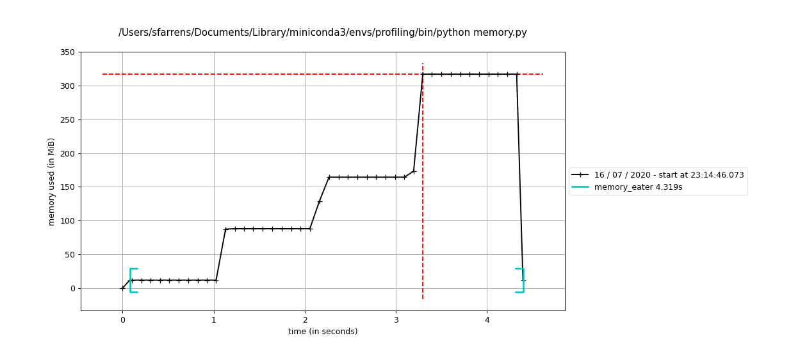

## Python Optimisation and Memory Management

> Author: <font color='#f78c40'>[Samuel Farrens](http://www.cosmostat.org/people/sfarrens)</font>    
> Year: 2020  
> Email: [samuel.farrens@cea.fr](mailto:samuel.farrens@cea.fr)  

## Contents

1. [Set Up](#Set-Up)
1. [Deterministic Profiling](#Deterministic-Profiling)
1. [Memory Profiling](#Memory-Profiling)
1. [Optimisation](#Optimisation)
1. [Further reading](#Further-Reading)

## Set Up

The easiest way to run all of the examples provided in this tutorial is to build the Conda environment.

```bash
$ conda env create -f environment.yml
```

Alternatively, you can simply install the requirements.

```bash
$ pip install -r requirements.txt
```

If you choose the latter, you will also need to install [Graphviz](https://graphviz.org/), which can done with `conda`, `apt` or `brew`.


## Deterministic Profiling

Before attempting to optimise your code (*i.e.* make it run faster) it is essential to profile it. It can take a lot of time to improve a code and this effort can easily be wasted if you optimise the wrong parts. Profiling, in particular *deterministic profiling*, enables you to identify potential bottlenecks in your code so that your can better focus any optimisation measures.

> Deterministic profiling is meant to reflect the fact that all function call, function return, and exception events are monitored, and precise timings are made for the intervals between these events (during which time the user's code is executing). - [source](https://docs.python.org/2.0/lib/Deterministic_Profiling.html#:~:text=Deterministic%20profiling%20is%20meant%20to,the%20user's%20code%20is%20executing)

### cProfile

[cProfile](https://docs.python.org/3/library/profile.html) is a built-in Python profiler. The commands can be written directly into modules/scripts to track the number of calls to functions and the time spent on each call. Alternatively, cProfile can be passed as an option to the `python` command when executing a script. For this tutorial, we will use the latter option.

We will start by looking at the [`sleeper.py`](./examples/sleeper.py) script. This script contains a function (`sleep_for_1s`) that calls Python's built-in [`sleep`](https://docs.python.org/3/library/time.html#time.sleep) method for one second. This will make it easy for us to assess the time spent on each call to this function. The other two functions in the script (`function1`, `function2`) simply make calls to the `sleep_for_1s` function.

Running the script on its own produces no output, however if we time the process we can see that it takes six seconds in total.

```bash
$ time python examples/sleeper.py
python sleeper.py  0.02s user 0.01s system 0% cpu 6.045 total
```

cProfile will allow us to see how many calls were made to each function in the script and how long each call took.

```bash
$ python -m cProfile examples/sleeper.py
```

The output should look something like this.

```
20 function calls in 6.009 seconds

Ordered by: standard name

ncalls  tottime  percall  cumtime  percall filename:lineno(function)
1    0.000    0.000    0.000    0.000 <frozen importlib._bootstrap>:1009(_handle_fromlist)
1    0.000    0.000    6.009    6.009 sleeper.py:1(<module>)
1    0.000    0.000    5.008    5.008 sleeper.py:11(function1)
1    0.000    0.000    1.000    1.000 sleeper.py:27(function2)
1    0.000    0.000    6.009    6.009 sleeper.py:37(main)
6    0.000    0.000    6.009    1.001 sleeper.py:4(sleep_for_1s)
1    0.000    0.000    6.009    6.009 {built-in method builtins.exec}
1    0.000    0.000    0.000    0.000 {built-in method builtins.hasattr}
6    6.009    1.001    6.009    1.001 {built-in method time.sleep}
1    0.000    0.000    0.000    0.000 {method 'disable' of '_lsprof.Profiler' objects}
```

We can also sort this output by *e.g.* the number of calls to a given function.

```bash
$ python -m cProfile -s calls examples/sleeper.py
```

Which gives.

```
18 function calls in 6.016 seconds

Ordered by: call count

ncalls  tottime  percall  cumtime  percall filename:lineno(function)
6    6.016    1.003    6.016    1.003 {built-in method time.sleep}
6    0.000    0.000    6.016    1.003 sleeper.py:4(sleep_for_1s)
1    0.000    0.000    6.016    6.016 {built-in method builtins.exec}
1    0.000    0.000    0.000    0.000 {method 'disable' of '_lsprof.Profiler' objects}
1    0.000    0.000    5.016    5.016 sleeper.py:11(function1)
1    0.000    0.000    1.000    1.000 sleeper.py:27(function2)
1    0.000    0.000    6.016    6.016 sleeper.py:37(main)
1    0.000    0.000    6.016    6.016 sleeper.py:1(<module>)
```

Where we can see that `sleep_for_1s` was called a total of six times for a cumulative time of six seconds. `function1` was called once for a cumulative time of five seconds. If we look at the code we can indeed see that `function1` calls `sleep_for_1s` five times. Finally,  `function2` was called once for a cumulative time of one second. If we add the time of the these two function calls we get the total runtime of the script, as expected.

### gprof2dot

[`gprof2dot`](https://github.com/jrfonseca/gprof2dot) is a Python package for converting cProfile outputs into a [dot graph](http://www.graphviz.org/doc/info/lang.html). These graphs will make it easier for us to visualise the profiling information.

First we tell cProfile to output to a file (*e.g.* `sleeper.pstats`).

```bash
$ python -m cProfile -o sleeper.pstats examples/sleeper.py
```

Then we can run `gprof2dot` on this output.

```bash
$ gprof2dot -f pstats sleeper.pstats | dot -Tpng -o sleeper.png
```

Which produces the following image.


Here we can more easily see the hierarchy and the number of calls to each function.

### SnakeViz

[SnakeViz](https://jiffyclub.github.io/snakeviz/) is a browser based graphical viewer for cProfile output.

As before we need a cProfile output file.

```bash
$ python -m cProfile -o sleeper.pstats examples/sleeper.py
```

Then we can run SnakeViz.

```bash
$ snakeviz sleeper.pstats
```

This will open a browser window where you can navigate and search for function calls.

This is particularly useful for more complicated scripts such as [`complicated.py`](./examples/complicated.py) that use a lot of built-in functions behind the scenes.

```bash
$ python -m cProfile -o complicated.pstats examples/complicated.py
$ snakeviz complicated.pstats
```

### pyinstrument

Finally, if you prefer an alternative to cProfile, various other tools also exist such as [pyinstrument](https://github.com/joerick/pyinstrument).

To run simply replace calls to `python` with `pyinstrument`.

```bash
$ pyinstrument examples/sleeper.py
```

Which will produce something like the following.

```
Program: examples/sleeper.py

6.011 <module>  sleeper.py:1
└─ 6.011 main  sleeper.py:52
   ├─ 5.009 function1  sleeper.py:26
   │  └─ 5.009 sleep_for_1s  sleeper.py:19
   └─ 1.001 function2  sleeper.py:42
      └─ 1.001 sleep_for_1s  sleeper.py:19
```

pyinstrument also allows for more interactive profiling by rendering the output as HTML.

```bash
$ pyinstrument -r html examples/sleeper.py
```

## Memory Profiling

The runtime is not the only consideration you should have when aiming to optimise your code. Inefficient memory management can be even more problematic as you can run into hardware limitations. As before, you should identify the greedy parts of your code before attempting to reduce the memory usage.

### Memory Profiler

[Memory Profiler](https://github.com/pythonprofilers/memory_profiler) is a package for monitoring the memory consumption of a Python process.

Similarly to cProfile, Memory Profiler can be run at the function level or on a whole script. To profile a single function, simply add a `@profile` decorator as done for the `memory_eater` function in the [`memory.py`](./examples/memory.py) script the execute the script as follows.

```bash
$ python -m memory_profiler examples/memory.py
```

Which will provide something like the following.

```
Line #    Mem usage    Increment   Line Contents
================================================
    21   11.879 MiB   11.879 MiB   @profile
    22                             def memory_eater():
    23                                 """Memory Eater
    24
    25                                 This function creates a list and increases the memory consumption several
    26                                 times before deleting the object.
    27
    28                                 """
    29
    30   11.879 MiB    0.000 MiB       big_list = [2]
    31   11.879 MiB    0.000 MiB       sleep(1)
    32
    33   88.176 MiB   76.297 MiB       big_list *= (10 ** 7)
    34   88.176 MiB    0.000 MiB       sleep(1)
    35
    36  164.469 MiB   76.293 MiB       big_list *= 2
    37  164.469 MiB    0.000 MiB       sleep(1)
    38
    39  317.055 MiB  152.586 MiB       big_list *= 2
    40  317.055 MiB    0.000 MiB       sleep(1)
    41
    42   11.879 MiB    0.000 MiB       del big_list
```

Where we can see total memory used and how much memory is added by each python object.

To profile the whole script use `mprof` as follows.

```bash
$ mprof run examples/memory.py
```

This will create a temporary file (`mprofile_<YYYYMMDDhhmmss>.dat`). You can visualise the content of this file by running.

```bash
mprof plot
```

Which produces the following type of plot.



Here we can clearly see that `memory_eater` function increases the memory consumption over time.

## Optimisation

Once you have profiled your code and identified the bottlenecks you can start working on ways to make it run more efficiently. Sadly, there is **no magic method** to make everything run faster. You will have to deal with things on a case by case basis and find the most appropriate way to optimise.

In the following subsections I will provide some tips and briefly introduce some tools to help you get started.

### Efficient Implementation

The first thing to look at, before using an special plugins or tricks, is how efficiently you have implemented your code. Look at your code and ask yourself:

- Is each function being called the correct number of times?
- Can any quantities be pre-computed to save time?
- Are any calculations being performed unnecessarily?

A very simplistic example of this is presented in [`efficient.py`](./examples/efficient.py). In this script two different approaches are shown for obtaining the same final quantities. In the *inefficient* implementation unnecessary calculations are made, while in the *efficient* implementation only the operations needed at a given time are performed. Try profiling this script to compare the two implementations.

### Pythonic Coding

One of the simplest ways to optimise your code is to take advantage of native Python data structures such as [*list comprehensions* ](https://docs.python.org/3/tutorial/datastructures.html#list-comprehensions), [*generators*](https://docs.python.org/3/c-api/gen.html), *etc.*

For example, identifying loops that can be replaced by more efficient list comprehensions can shave valuable seconds off your code. Have a look at the script [`list_comp_vs_loop.py`](./examples/list_comp_vs_loop.py). The objective is to produce a list of cubed values from zero to `n`, however in one function this is accomplished using a standard loop, while the other implements a list comprehension. Try profiling both of this script to identify which implementation is faster.

> See [Pythonic Thinking](https://github.com/CosmoStat/Tutorials/tree/python#tutorial-2-intermediate-and-advanced-topics) tutorial for more examples.

### Numba

There are various packages specifically designed to speed up calculations in Python. [Numba](http://numba.pydata.org/) is one such package that works particularly well in conjunction with Numpy.

> Numba is a compiler for Python array and numerical functions that gives you the power to speed up your applications with high performance functions written directly in Python. - [source](https://numba.pydata.org/numba-doc/latest/user/overview.html#overview)

Numba works by compiling the first call to a given function meaning that subsequent calls do not require interpretation and are thus executed much faster.

In the script [`numba_vs_numpy.py`](./examples/numba_vs_numpy.py) we compare two functions to calculate `tanh` of the diagonal elements of a matrix, one implemented with Numba and the other without. Try profiling this script to compare the performance of the two implementations. What happens if you reduce the number of calls to each function?

### Memory Mapping

Reducing the memory consumption of your code can be a challenging problem. There are, however, some tricks such as memory mapping that can have a big impact.

The [`memory_map.py`](./examples/memory_map.py) script demonstrates how loading a Numpy binary file as a memory map can significantly reduce the amount memory used. Try profiling this script to see how much of an impact this makes.

## Further Reading
- [Python Profiling](https://medium.com/@antoniomdk1/hpc-with-python-part-1-profiling-1dda4d172cdf)
