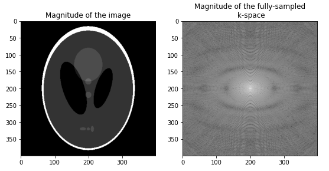

id: tensorflow-introduction
summary: Introduction to TensorFlow for CosmoStat Folks
authors: Francois, Zaccharie
categories: Meta
tags: beginner
feedback link: https://github.com/CosmoStat/Tutorials/issues/new?assignees=&labels=bug&template=bug_report.md&title=%5BBUG%5D

# From zero to MRI hero in 60 minutes with TensorFlow

## Overview
Duration: 1


In this codelab you will learn the core concepts for TensorFlow 2.0 and will
apply them to solve a classical MRI problem in a few lines of code. We will not
focus on neural networks, but rather on the powerful automatic differentiation
capabilities of TensorFlow which can be used for a wide range of applications.

#### What you'll learn

- What is Tensor and how it differs from a Numpy array
- How to define a computational graph and compute gradients
- How to introduce variables, and perform optimization
- How to apply these techniques to solve an MRI problem

#### What you'll need

Nothing but a web browser, everything will happen on Google Colaboratory.

### Feedback

Don't hesitate to suggest modifications or report issues through GitHub [[feedback link](https://github.com/CosmoStat/Tutorials/issues/new)].

## Quick Introduction to Google Colaboratory
Duration: 5

Before diving into this tutorial, let us just review the basics of google colab.

TODO here:
 - Provide details on how long colab runs, what compute is available
 - Show how to select GPU acceleration
 - Link to reference for more info

## What is a Tensor?
Duration: 5

TODO here:
  - Import tensorflow
  - Create a tensor, explain

## Writing a computational graph
Duration: 4

TODO here:
  - Show how to combine several ops
  - Maybe explain the concept of tf functions (maybe this is out of scope)
  - Explain briefly what happens under the hood when the code is executed

## Computing gradients
Duration: 5

TODO here:
  - Introduce the concept of gradient tape
  - Show how to compute gradients of a simple expression
  - Compare to analytic solution obtained manually in numpy

## Optimization
Duration: 5

TODO here:
  - Introduce variables
  - Show how to perform gradient descent manually
  - Introduce keras optimizers

## MRI example
Duration: 5

Now that we know the basics of TensorFlow, let's apply what we know to a signal
processing toy example.

TODO here:
  - Explain the MRI problem
  - Show how to access the Shepp-Logan phantom

    ```
    image = np.load('Tutorials/shepp_logan.npy')
    ...
    kspace = tf_fft(image)
    ```
  - Illustrate with plots
  

  - Apply mask in Fourier domain

## Classical iterative reconstruction
Duration: 15

TODO here:
  - Quickly explain what TV is, why it's cool and the sparse problem we are
  trying to solve
  - Introduce things like `tf.image.total_variation`
  - Let people write their own loss
  - Let people optimize that loss
  - Evaluation of the results

## Deep Learning approach
Duration: 15

TODO here:
  - Explain training data, skip over tf.data stuff
  - Briefly introduce the Keras API
  - Leave it as an exercise to train their own models
  - Evaluation of the results

Solution to this notebook here: [Add link to finished notebook]

## Congratulations!
Duration: 1

TODO:
  - Add references and links to further reading material
  - Add link to github issue for complaints
  - Pictures of the nice people who made this tutorial
