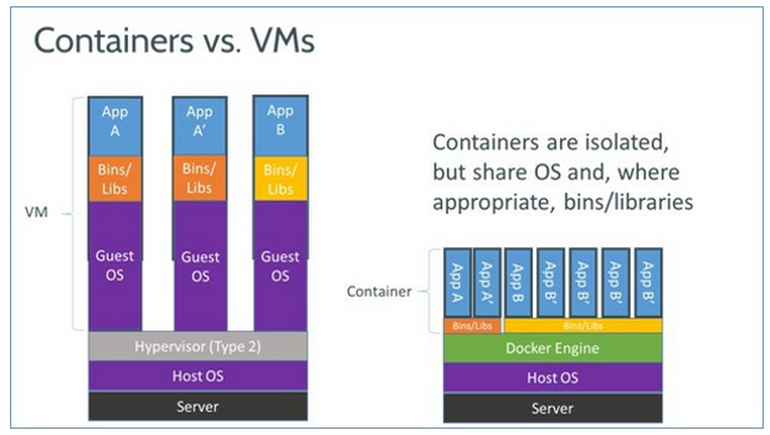

id: docker-introduction
summary: Introduction to Docker
authors: Francois Lanusse
categories: Meta
tags: beginner
feedback link: https://github.com/CosmoStat/Tutorials/issues/new?assignees=&labels=bug&template=bug_report.md&title=%5BBUG%5D

# Getting started with Docker for Data Scientists

## Overview
Duration: 1

In this codelab you will learn how to use Docker to package your software
tools for painless distribution and easy reproducibility of your research.

We will use as an example the common case of building a container
to distribute Jupyter notebooks, for instance accompanying a paper
or for a tutorial. Here is the tutorial we will be looking at: [ https://github.com/CosmoStat/octave_image_processing_example]( https://github.com/CosmoStat/octave_image_processing_example).


#### What you'll learn

- What is Docker and what is a container
- How to run a container
- How to build your own container
- How to host containers on dockerhub

#### What you'll need

We will assume that you have pre-installed the Docker command line tools on your  
machine. You can find OS specific instructions for installing Docker at the
following links:
- Mac OS: [https://docs.docker.com/docker-for-mac/install/](https://docs.docker.com/docker-for-mac/install/)
- Windows: [https://docs.docker.com/docker-for-windows/install/](https://docs.docker.com/docker-for-windows/install/)
- Ubuntu: [https://docs.docker.com/engine/install/ubuntu/](https://docs.docker.com/engine/install/ubuntu/)
- archlinux: `pacman -S docker`


### Feedback

Don't hesitate to suggest modifications or report issues through GitHub [[feedback link](https://github.com/CosmoStat/Tutorials/issues/new)].

## What is a Docker container?
Duration: 10

Before diving into this tutorial, we will first try to understand what is a
container, and how it differs from a virtual machine.

### Containers package executables and libraries

Any software you might build is never completely standalone, it depends on
external libraries and is typically compiled for a specific OS.

So how do you make sure someone else can use your code on their own machine?

In principle, you would have to exactly specify all the libraries you use, and
leave it to the user to install those. Even then, you typically cannot guarantee
that your code will 100% reproduce the expected results as the behavior of
some of these external libraries might change between versions and might be
environment specific.

**The solution**: packaging not only your code, but a complete environment including
all external libraries. This is what a container does.




This is reminiscent of what virtual machines used to do, remember virual box and
VMware? But there is one crucial difference:

- In virtual machines each application requires a full guest operating system
running on a software emulation of a physical machine: they are slow and very
heavy.

- A container is only packaging executables and libraries, which are executed on
a shared kernel provided by the Docker Engine: it's essentially just like running
any other application on your system, there is no boot up time required.

### Containers are based on layers, layers can be shared

Not only are containers lighter than VM since they don't need to run full guest
OSes, they can also share some common libraries/tools between several containers.

In order to make this work, containers are build by layers. You can add a new
layer on top of an existing container, for instance to add a new library, and
you get a new container, but  the base layers will be identical between the two.


This means that if you build 10 containers for 10 small executables, but based on
the same base container you only need to store the base and the 10 small different
additional layers.

Here is an illustration that shows how different containers built out of same or
different base containers share common layers:


Alright, so now that we have a little idea of what a container is, the next
step is to use one :-)

## Running our first container
Duration: 10

### Retrieving an image from DockerHub

The first step will be to download a minimal container from [DockerHub](https://hub.docker.com/), a central repository for docker containers. You can search
this repository and find many useful and already built images for many software. To retrieve a container from this repository, you simply use  the `docker pull` command.

To get started, let's use the minimal Alpine Linux container available [here](https://hub.docker.com/_/alpine). This is an official image provided by
Docker, with only a 5 MB footprint.

Let's go ahead and download it from the command line:
```bash
$ docker pull alpine
Using default tag: latest
latest: Pulling from library/alpine
cbdbe7a5bc2a: Pull complete
Digest: sha256:9a839e63dad54c3a6d1834e29692c8492d93f90c59c978c1ed79109ea4fb9a54
Status: Downloaded newer image for alpine:latest
docker.io/library/alpine:latest
```
Success! What we see here is that Docker is pulling the latest version of that
image from the repository.

### Running a command in the container

Now that the image is downloaded, we can run commands from that container. Let's
start with the following:
```bash
$ docker run -it alpine sh
/ #
```
What happened here? We are now using the `docker run` command, this starts a new
process using the executable `sh` from the image `alpine`. The `-it` is necessary
for interactive commands.
And what we see on the prompt of the second line is now the shell prompt from
the container.

At this point, you can look around, everything you do is in the container, isolated
from the host system:
```sh
/ # ls
bin    etc    lib    mnt    proc   run    srv    tmp    var
dev    home   media  opt    root   sbin   sys    usr
```
what we see here is the content of the root directory of the container.

To exit the container, just exit the shell:
```sh
/ # exit
$
```

Here we have started a shell inside the container, but you can also call any
other binary from the container like so:

```sh
$ docker run -it alpine ls
bin    etc    lib    mnt    proc   run    srv    tmp    var
dev    home   media  opt    root   sbin   sys    usr
```

At this point, you may realize that there is an issue, this `ls` command is only
showing the files from inside the image, not the files on your current directory.
Luckily, we can fix that!

### Mounting a local folder to access your files
s
In the previous example, the container filesystem was completely isolated from
the host, so that's moderately useful, you want to be able to see your local
files.
You can do that by mounting your local folder on a given directory inside the
image with the `-v [host directory]:[image directory]` flag. Here is an example
where we mount the local folder to /workdir inside the image:
```bash
$ docker run -v ${PWD}:/workdir -it alpine ls /workdir
assets               docker-introduction
codelab_notes.txt    tutorial.md
```
and now we see the files of our current folder.

So this is how you access your data from the container.

## The illustrative example: distributing codes and notebooks for a tutorial
Duration: 5

Now that we understand the basics of Docker, we can move on to the actual
problem we want to solve in this tutorial, how can Fadi distribute his Octave
notebooks and hope that people can actually run them on their own machine?


We will begin by forking a copy of Fadi's original repository, and clone it
locally. Follow these steps:

  - Go to [https://github.com/CosmoStat/octave_image_processing_example](https://github.com/CosmoStat/octave_image_processing_example) and click
  the fork button:
  
  You can fork this repository to your own GitHub account, and don't worry you
  can always remove it later.

  - Now that you have made a fork, clone it locally by clicking the big green
  clone button:
  
  and copying the content of the text box to complete a git clone command line,
  which look like this, except with the path to your own fork:
  ```bash
  $ git clone git@github.com:CosmoStat/octave_image_processing_example.git
  ```
  if you haven't setup git with SSH keys and you get any complaints at this step,
  click the `Use HTTPS` option in the box above to switch to HTTPS downloading,
  it would then look like this:
  ```bash
  $ git clone https://github.com/CosmoStat/octave_image_processing_example.git
  ```

  - Finally, you can `cd` into this cloned directory:
  ```bash
  $ cd octave_image_processing_example
  $ ls
  apt.txt            canards.png         environment.yml  filtre_min.m     README.md
  canards_gauss.mat  canards_poivre.mat  example.ipynb    generate_data.m
  canards.mat        canards_sel.mat     filtre_max.m     moyenneur.m
  ```

Alright, so we have downloaded the content of the tutorial, but now, imagine that
we wanted to run the examples. You can try the following:
```bash
$ jupyter notebook
```
Hopefully you have jupyter installed, but maybe not, and even if you do try
opening `example.ipynb` with jupyter, chances are that won't work because you
don't have Octave installed.

We are now going to see how to use Docker to make sure people can run the notebook
on their machine without having to install anything.

## Composing a Dockerfile
Duration: 5

We are going to build an image that contains all of the environment required
to run jupyter notebooks with the Octave kernel, and also package the tutorial
contents.

To define a new Docker container, you need to create an empty text file name
`Dockerfile` in the current directory. Now in this file we will add the following
content:

```Docker
FROM jupyter/base-notebook

LABEL Description="Jupyter Octave"

USER root
RUN apt-get update && \
    apt-get install -y gnuplot octave && \
    apt-get clean

USER jovyan
RUN pip install octave_kernel && \
    export OCTAVE_EXECUTABLE=$(which octave)
```

Let's unpack what's going on here:

#### Inheriting from a base image

```Docker
FROM jupyter/base-notebook
```
This tells Docker that your container will inherit the `jupyter/base-notebook`
image, which you can see [here](https://hub.docker.com/r/jupyter/base-notebook/).
In general, it is good practice for you to try to base your container on an existing
and popular one containing most of the environment you want already, instead of
composing an image from a bare linux.

#### Changing user inside the container

```Docker
USER root
```
This instruction tells Docker that the  following commands will be executed as
`root` which allows you to install system packages.

#### Installing new packages from the linux package manager

```Docker
RUN apt-get update && \
    apt-get install -y gnuplot octave && \
    apt-get clean
```
This is the main part of the Dockerfile, here we use the `RUN` command, to run a
command inside the container, here, it's in order to install additional packages.
We run the standard Ubuntu package manager to install `gnuplot` and `octave` which
were not already on the image. The `apt-get clean` part is to remove any unnecessary
cached files at the end of this install.

Negative
: Each `RUN` command essentially adds a new layer to the container. The new state
of the image will be recorded at the end of the `RUN` and the layer is defined
as the delta compared to the previous step. This is why we make sure to `clean`
at the end because we don't want unnecessary files to get added to the layer.

#### Installing pip packages
```Docker
USER jovyan
RUN pip install octave_kernel && \
    export OCTAVE_EXECUTABLE=$(which octave)
```
Finally here, what we are doing is switching to the `jovyan` user, the standard
non-privileged user for the jupyter image, defined in the base image, and installing
Python packages as a normal user.
We simply add the `octave_kernel` so that Jupyter knows how to run Octave code.

And that's it, that's all there is to writing a Dockerfile, it's just a series
of `RUN` commands that you can use to install any tools/libraries you need.


Positive
: Note that one of the reasons it's so easy to define this Jupyter-Octave container
is that all the heavy lifting of installing and setting up Jupyter is done in the
parent `jupyter/base-notebook` image. You can have a look at the Dockerfile of
that parent image [here](https://hub.docker.com/r/jupyter/base-notebook/dockerfile).
And you'll quickly see why it's a good idea to build on top of an existing container ;-)

Now the next step is to build your container from this Dockerfile description.


## Building your container
Duration: 10

Given the Dockerfile defined at the previous step, we can now tell Docker to
process it in order to build your new container. This is done with the `docker build`
command. Assuming you are still in the same folder as your Dockerfile, just run:
```bash
$ docker build -t jupyter-octave .
```
This instructs Docker to process the local directory `.`, parse your Dockerfile, and
build a new image that will be tagged `jupyter-octave` version `1.0` thanks to the
`-t` flag.

Running this command, you will see Docker first pull all the layer of the base
image, and then execute the `RUN` commands you have defined. In principle everything
should work :-)

Once built, let's try to use it to start a Jupyter notebook with an Octave kernel.
From your current directory, run:
```Docker
$ docker run -p 8888:8888 -v ${PWD}:/home/jovyan/work -it jupyter-octave
```
What we are doing here, is running our newly created `jupyter-octave` container,
using the `-v` flag we have seen before to mount our local directory inside the
container, and the new `-p` flag to forward the `8888` port which is where the
jupyter notebook server will be listening in for connections. Note that we are
not telling Docker to run any particular commands at the end, in this case,
Docker will default to an `ENTRYPOINT` defined in the parent container, and
automatically start `jupyter-notebook`.

Jupyter should start inside the container and give you a message like this:

```bash
[C 08:52:00.695 NotebookApp]

    To access the notebook, open this file in a browser:
        file:///home/jovyan/.local/share/jupyter/runtime/nbserver-6-open.html
    Or copy and paste one of these URLs:
        http://bc85b42df82d:8888/?token=085a531b2df604a9089320c09af9601135604e607ace921b
     or http://127.0.0.1:8888/?token=085a531b2df604a9089320c09af9601135604e607ace921b
```
Just follow the last link in `http://127.0.0.1:8888...` and open it in your
web browser. And tadaa! you are now accessing the Jupyter notebook running in
your container!

Go on to the `work/example.ipynb` notebook, and you should now be able to run
Octave code without issues.

## Pushing to dockerhub
Duration: 15

The last step is publishing your docker image so that others can use it easily.
To do that, we will want to push it to DockerHub.

#### Step 1: Adding the Dockerfile to your git fork

We will use DockerHub to automatically build your container from your git
repository. In order to set that up, let's start by adding your Dockerfile
to the repository:

```bash
$ git add Dockerfile
$ git commit -m "Adding Docker container file"
$ git push
```
This updates your fork of Fadi's repository to include the Dockerfile. To make
sure that worked, you can check that you see the Dockerfile on GitHub.

#### Step 2: Creating a DockerHub account

We will need a Docker Hub account, you can sign up for one here:

[https://hub.docker.com/signup](https://hub.docker.com/signup)

or if you already have an account, you can sign-in here: [https://hub.docker.com/sso/start](https://hub.docker.com/sso/start)

#### Step 3: Connect your GitHub account

Now that you are connected on DockerHub go to Account Settings


And in the `Linked Accounts` tab, click the `Connect` button for GitHub:


Follow the instructions, and grant DockerHub access to repos under your account
on GitHub.

#### Step 4: Create an automatic build of your Dockerfile

Now that everything is setup, you can go back to the landing page of `DockerHub`
at this link: [https://hub.docker.com/](https://hub.docker.com/) and click the
`Create Repository` blue button on the top right.

- In the first field, you can create a new image called `jupyter-octave`, and add a short description in the field below:


- Then in the `Build Settings`, click on the GitHub icon and navigate to your fork of the repo. Next to the `BUILD RULES` header, click the `+` sign to add
a build rule, and by  default DockerHub will propose a build rule looking for
your Dockerfile at the root of the master branch of your repository. It should look like this:


And finally click the `Create & Build` button!

This will bring you to the page of your newly minted container! Head over to the `Builds` tab to see the status of your automated build.

Positive
: New builds will automatically get triggered everytime you make a push to your
GitHub repo so you are sure that your image is always up to date.

As soon as you see that your build is ready, you can pull it on your local
computer:

```bash
$ docker pull [your dockerhub name]/jupyter-octave
```
And done! Anyone on earth can now run your notebooks without having to install
Jupyter or Octave on their machine !

## Congratulations!
Duration: 1

You are now a Docker Guru :-) Or at least a Docker baby Yoda.

We have covered the basics of how to use Docker but glossed over a lot of
details and features. If you want to know more, Google is your friend, there
are tons of tutorial out there. But here are some useful references:

  - [Official Docker intro](https://docs.docker.com/get-started/)
  - [Dockerfile reference](https://docs.docker.com/engine/reference/builder)

Happy containerization!!!!
